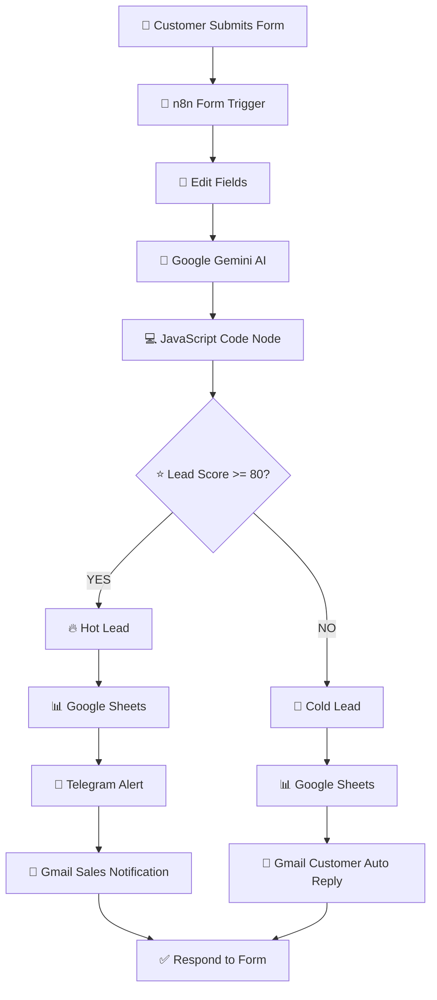
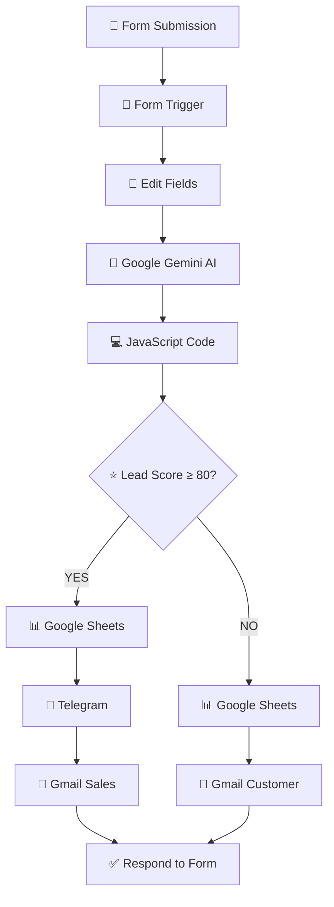

# 📄 CRM Lead Automation — n8n Automation


\

An AI-powered Customer Relationship Management (CRM) workflow built using **n8n**, **Google Gemini AI**, **Google Sheets**, **Telegram Bot API**, **Gmail**, and the **n8n Form Trigger**.

This workflow automatically receives business inquiries through an online form, analyzes each lead using Artificial Intelligence, assigns a qualification score, classifies lead priority, stores lead information in Google Sheets, notifies the sales team of high-value opportunities, and sends automated email responses.

**Stack**

n8n · Google Gemini AI · Google Sheets · Gmail API · Telegram Bot API · JavaScript · AI Automation · CRM Automation

---

# 🎯 Project Overview

## Problem

Many small businesses still manage customer inquiries manually.

Sales representatives often experience problems such as:

* Receiving inquiries through different platforms
* Forgetting to follow up with potential customers
* Manually copying customer information into spreadsheets
* Difficulty identifying which leads deserve immediate attention
* Losing potential customers because responses are delayed

As businesses receive more inquiries, manually handling every lead becomes inefficient.

Common business processes affected include:

* Lead collection
* Customer qualification
* Sales prioritization
* CRM management
* Customer communication

---

## Solution

This project creates an AI-powered CRM workflow that automatically performs the first stage of the sales process.

When a customer submits a business inquiry, the workflow automatically:

1. Receives the inquiry using an n8n Form.
2. Cleans and standardizes customer information.
3. Uses Google Gemini AI to evaluate the quality of the lead.
4. Assigns a lead score between 0–100.
5. Classifies the lead as Hot or Cold.
6. Stores the lead in Google Sheets.
7. Sends instant Telegram notifications for Hot Leads.
8. Emails the sales team for immediate follow-up.
9. Sends an automatic acknowledgment email to lower-priority leads.

Instead of manually reviewing every inquiry, the sales team can focus first on customers with the highest potential.

---

# ✨ Features

## Lead Collection

✅ Built-in n8n Form Trigger

✅ Secure online inquiry form

✅ Automatic customer data collection

✅ No third-party form service required

---

## Artificial Intelligence

✅ Google Gemini AI lead qualification

✅ AI-generated lead scoring

✅ Industry identification

✅ Business inquiry summarization

✅ AI-generated next action recommendations

---

## CRM Automation

✅ Google Sheets CRM database

✅ Automatic lead logging

✅ Hot vs Cold lead classification

✅ Structured lead records

---

## Notifications

✅ Telegram notifications for Hot Leads

✅ Gmail notifications for Sales Team

✅ Automatic customer acknowledgment emails

---

## Business Automation

✅ Sales workflow automation

✅ Customer response automation

✅ Real-time notifications

✅ Automated CRM updates

---

# 🗺️ System Architecture



---

# 🏗️ Workflow Overview

The CRM Lead Automation workflow follows a complete lead management process from customer inquiry to sales notification.

The workflow begins with an online form created using the **n8n Form Trigger**. Instead of relying on external form providers, n8n hosts the form directly, allowing customers to submit inquiries securely.

After submission, the workflow cleans and standardizes the incoming data using an **Edit Fields** node. This ensures all downstream nodes receive consistent information.

The inquiry is then sent to **Google Gemini AI**, which evaluates the lead based on factors such as:

* Company size
* Estimated budget
* Job title
* Business inquiry
* Overall purchase intent

Gemini returns structured JSON containing:

* Lead Score
* Priority
* Industry
* Summary
* Recommended Next Action
* Confidence Level

A JavaScript Code node converts the AI response into structured workflow data.

An IF node then determines the lead's priority:

* **Lead Score ≥ 80** → Hot Lead
* **Lead Score < 80** → Cold Lead

Hot Leads are:

* Saved to Google Sheets
* Sent to Telegram instantly
* Emailed to the Sales Team

Cold Leads are:

* Saved to Google Sheets
* Sent an automatic acknowledgment email

Finally, the workflow displays a confirmation message to the customer, confirming that their inquiry has been successfully received.

This automation removes repetitive manual tasks, improves response times, and helps sales teams focus on the most valuable opportunities.

---

# 🚀 Business Benefits

Implementing this workflow provides several advantages:

* Faster lead response times
* AI-assisted sales qualification
* Centralized CRM records
* Reduced manual data entry
* Automated customer communication
* Improved sales productivity
* Better lead prioritization
* Scalable customer onboarding process

---

# 🧩 Technologies Used

| Technology       | Purpose                       |
| ---------------- | ----------------------------- |
| n8n              | Workflow Automation Platform  |
| Google Gemini AI | Lead Analysis & Qualification |
| Google Sheets    | CRM Database                  |
| Gmail API        | Email Notifications           |
| Telegram Bot API | Sales Alerts                  |
| JavaScript       | JSON Processing               |
| n8n Form Trigger | Customer Inquiry Form         |

---

# 📈 Workflow Summary

```text
Customer

↓

n8n Form

↓

Edit Fields

↓

Google Gemini AI

↓

JavaScript Parser

↓

IF (Lead Score)

├── Hot Lead
│      ↓
│ Google Sheets
│      ↓
│ Telegram
│      ↓
│ Gmail (Sales)
│
└── Cold Lead
       ↓
Google Sheets
       ↓
Gmail (Customer)

↓

Respond to Form
```

---
# 🏗️ Workflow Implementation

---

# Workflow 1 — CRM Lead Qualification Pipeline

This workflow automates the complete customer lead qualification process, from receiving a business inquiry to notifying the sales team and updating the CRM database.

---

# Node 1 — n8n Form Trigger

## Purpose

Receive business inquiries directly from customers through a built-in online form.

Unlike third-party form builders, the **n8n Form Trigger** hosts the form inside your n8n instance, making the workflow self-contained and easy to deploy.

### Configuration

```text
Trigger

n8n Form Trigger
```

Form Title

```text
CRM Lead Automation Demo
```

Form Description

```text
Please fill out the form below and our sales team will contact you.
```

### Form Fields

| Label               | Type       | Required |
| ------------------- | ---------- | -------- |
| Full Name           | Text Input | ✅        |
| Email               | Email      | ✅        |
| Company             | Text Input | ✅        |
| Job Title           | Text Input | ✅        |
| Number of Employees | Number     | ✅        |
| Estimated Budget    | Number     | ✅        |
| How can we help?    | Text Area  | ✅        |

---

### Example Submission

```json
{
"name":"John Doe",
"email":"john@technova.com",
"company":"TechNova",
"jobTitle":"IT Manager",
"employees":250,
"budget":20000,
"message":"We want to automate our internal workflow approvals."
}
```

---

# Node 2 — Edit Fields

## Purpose

Normalize and organize incoming customer information before sending it to AI.

This node creates a clean and predictable data structure that every downstream node can use.

### Fields Created

| Field     | Description              |
| --------- | ------------------------ |
| timestamp | Submission time          |
| name      | Customer name            |
| email     | Customer email           |
| company   | Company name             |
| jobTitle  | Customer job title       |
| employees | Number of employees      |
| budget    | Estimated project budget |
| message   | Customer inquiry         |

---

### Output Example

```json
{
"timestamp":"2026-07-14",
"name":"John Doe",
"email":"john@technova.com",
"company":"TechNova",
"jobTitle":"IT Manager",
"employees":250,
"budget":20000,
"message":"We want to automate our workflow approvals."
}
```

---

# Node 3 — Google Gemini AI Agent

## Purpose

Analyze the business inquiry and determine whether the customer is a valuable sales opportunity.

Instead of manually reviewing every inquiry, Google Gemini evaluates the lead automatically.

### Evaluation Criteria

The AI considers:

* Company size
* Estimated budget
* Job position
* Business intent
* Overall buying potential

---

### AI Output

The AI returns structured JSON.

```json
{
"lead_score":92,
"priority":"High",
"industry":"Technology",
"summary":"Large technology company looking for workflow automation.",
"next_action":"Schedule a product demonstration within 24 hours.",
"confidence":95
}
```

---

### Output Fields

| Field       | Description               |
| ----------- | ------------------------- |
| lead_score  | Overall score (0–100)     |
| priority    | High / Medium / Low       |
| industry    | Business sector           |
| summary     | AI-generated lead summary |
| next_action | Recommended follow-up     |
| confidence  | AI confidence score       |

---

# Node 4 — JavaScript Code Node

## Purpose

Convert the AI-generated JSON string into structured workflow data.

The Code node also merges the original customer information with the AI analysis.

### Processing Flow

```text
Google Gemini Output

↓

JSON.parse()

↓

Merge Customer Data

↓

Structured CRM Record
```

---

### Output Example

```json
{
"name":"John Doe",
"email":"john@technova.com",
"company":"TechNova",
"jobTitle":"IT Manager",
"employees":250,
"budget":20000,
"lead_score":92,
"priority":"High",
"industry":"Technology",
"summary":"Large technology company looking for workflow automation.",
"next_action":"Schedule a product demonstration.",
"confidence":95
}
```

---

# Node 5 — IF Node

## Purpose

Determine whether the customer should be prioritized by the sales team.

### Condition

```javascript
{{$json.lead_score >= 80}}
```

---

## TRUE Branch

Lead Score **80 or above**

Classification:

```text
🔥 Hot Lead
```

Actions

* Save to Google Sheets
* Notify Telegram
* Notify Sales Team

---

## FALSE Branch

Lead Score **below 80**

Classification

```text
📌 Cold Lead
```

Actions

* Save to Google Sheets
* Send Customer Email

---

# Node 6 — Google Sheets (Hot Leads)

## Purpose

Store qualified leads inside the CRM database.

Each Hot Lead becomes a permanent CRM record for future sales activities.

### Database Columns

| Column      | Description          |
| ----------- | -------------------- |
| Timestamp   | Date received        |
| Name        | Customer             |
| Email       | Contact email        |
| Company     | Organization         |
| Job Title   | Position             |
| Employees   | Company size         |
| Budget      | Estimated budget     |
| Industry    | AI classification    |
| Lead Score  | AI score             |
| Priority    | Lead priority        |
| Summary     | AI summary           |
| Next Action | Sales recommendation |
| Confidence  | AI confidence        |
| Status      | Hot                  |

---

### Example Record

| Name     | Company  | Score | Status |
| -------- | -------- | ----: | ------ |
| John Doe | TechNova |    92 | Hot    |

---

# Node 7 — Telegram Notification

## Purpose

Notify the sales team immediately whenever a high-value lead is identified.

Real-time notifications reduce response time and improve conversion opportunities.

---

### Example Telegram Message

```text
🔥 NEW HOT LEAD

👤 Name:
John Doe

🏢 Company:
TechNova

📧 Email:
john@technova.com

⭐ Lead Score:
92

📌 Priority:
High

🏭 Industry:
Technology

📝 Summary:
Large technology company interested in workflow automation.

➡ Recommended Action:
Schedule a product demonstration within 24 hours.

🤖 Generated automatically using Google Gemini AI.
```

---

# Node 8 — Gmail (Sales Notification)

## Purpose

Send a detailed email to the sales team whenever a Hot Lead is detected.

The email contains all important customer information together with the AI recommendation.

### Subject

```text
🔥 New Hot Lead - TechNova
```

---

### Email Content

```text
A new qualified lead has been detected.

Customer Information

Name:
John Doe

Company:
TechNova

Email:
john@technova.com

Lead Score:
92

Priority:
High

Industry:
Technology

Summary:
Large technology company interested in workflow automation.

Recommended Action:
Schedule a product demonstration within 24 hours.

Generated automatically by the CRM Lead Automation workflow.
```

---

# Node 9 — Google Sheets (Cold Leads)

## Purpose

Store lower-priority leads inside the same CRM database.

Although these customers are not immediate sales opportunities, they remain available for future marketing campaigns and follow-up activities.

### Status

```text
Cold
```

---

### Example Record

| Name        | Company  | Score | Status |
| ----------- | -------- | ----: | ------ |
| Alice Smith | StartupX |    55 | Cold   |

---

# Node 10 — Gmail (Customer Auto Reply)

## Purpose

Automatically acknowledge customer inquiries.

Every customer receives a professional confirmation email immediately after submitting the form.

---

### Subject

```text
Thank you for contacting us
```

---

### Email

```text
Hello John Doe,

Thank you for contacting us.

We have successfully received your inquiry.

Our team will review your request and contact you as soon as possible.

We appreciate your interest in our services.

Best regards,

Sales Team
```

---

# Node 11 — Respond to Form

## Purpose

Display a confirmation page after the workflow completes.

This provides immediate feedback to customers that their submission has been received successfully.

---

### Response

```text
✅ Thank you!

Your inquiry has been received successfully.

Our sales team will review your request and contact you soon.
```

---

# 🔄 Complete Workflow


# 🔐 Credentials Required

| Service           | Purpose                      |
| ----------------- | ---------------------------- |
| Google Gemini API | AI Lead Qualification        |
| Google OAuth2     | Google Sheets & Gmail Access |
| Telegram Bot API  | Sales Notifications          |
| n8n Instance      | Workflow Execution           |

---

# ⚙️ Setup Guide

## 1. Clone the Repository

```bash
git clone https://github.com/belioautomation/CRM-Lead-Automation.git

cd CRM-Lead-Automation
```

---

## 2. Import the Workflow

Inside n8n:

```text
Import Workflow

↓

workflow.json
```

---

## 3. Configure Google Credentials

Create a Google Cloud Project.

Enable:

```text
Google Sheets API

Gmail API
```

Create OAuth2 credentials and connect them inside n8n.

---

## 4. Configure Google Gemini

Obtain a Google Gemini API Key.

Create a Gemini credential inside n8n.

Assign the credential to the AI Agent node.

---

## 5. Configure Telegram

Create a Telegram Bot.

Steps:

1. Open Telegram
2. Search **BotFather**
3. Create a Bot
4. Copy the Bot Token
5. Create Telegram Credentials in n8n
6. Enter your Chat ID

---

## 6. Configure Google Sheets

Create a spreadsheet named:

```text
CRM Lead Database
```

Create a worksheet named:

```text
Leads
```

Add the following columns.

| Column      |
| ----------- |
| Timestamp   |
| Name        |
| Email       |
| Company     |
| Job Title   |
| Employees   |
| Budget      |
| Industry    |
| Lead Score  |
| Priority    |
| Summary     |
| Next Action |
| Confidence  |
| Status      |

---

## 7. Configure Gmail

Select your Gmail OAuth credential.

The workflow uses Gmail for:

* Sales Team Notifications
* Customer Auto Replies

---

## 8. Activate the Workflow

Click

```text
Activate
```

Your CRM automation is now ready to receive customer inquiries.

---

# 🧪 Testing Checklist

| Test Case       | Expected Result            |
| --------------- | -------------------------- |
| Submit Form     | Workflow starts            |
| Edit Fields     | Customer data normalized   |
| Gemini AI       | Lead analyzed              |
| JSON Parser     | AI output parsed           |
| Lead Score ≥ 80 | TRUE branch                |
| Lead Score < 80 | FALSE branch               |
| Google Sheets   | Lead stored                |
| Telegram        | Hot Lead notification sent |
| Gmail Sales     | Email notification sent    |
| Gmail Customer  | Thank-you email sent       |
| Respond to Form | Success message displayed  |

---

# 📥 Sample Form Submission

```json
{
"name":"John Doe",
"email":"john@technova.com",
"company":"TechNova",
"jobTitle":"IT Manager",
"employees":250,
"budget":20000,
"message":"We want to automate our internal approval workflow."
}
```

---

# 🤖 Sample AI Output

```json
{
"lead_score":92,
"priority":"High",
"industry":"Technology",
"summary":"Large technology company interested in workflow automation.",
"next_action":"Schedule a product demonstration within 24 hours.",
"confidence":95
}
```

---

# 📊 Sample Google Sheets Record

| Timestamp  | Name     | Company  | Lead Score | Priority | Status |
| ---------- | -------- | -------- | ---------: | -------- | ------ |
| 2026-07-14 | John Doe | TechNova |         92 | High     | Hot    |

---

# 📱 Sample Telegram Notification

```text
🔥 NEW HOT LEAD

👤 Name:
John Doe

🏢 Company:
TechNova

⭐ Lead Score:
92

📌 Priority:
High

📝 Summary:
Large technology company interested in workflow automation.

➡ Recommended Action:
Schedule a product demonstration within 24 hours.

🤖 Generated automatically using Google Gemini AI.
```

---

# 📧 Sample Customer Email

**Subject**

```text
Thank you for contacting us
```

**Body**

```text
Hello John Doe,

Thank you for contacting us.

We have received your inquiry successfully.

Our sales team will review your request and contact you as soon as possible.

We appreciate your interest in our services.

Best regards,

Sales Team
```

---

# 📁 Repository Structure

```text
CRM-Lead-Automation/

│
├── README.md
│
├── workflow.json
│
├── screenshots/
│   │
│   ├── workflow.png
│   ├── form-trigger.png
│   ├── edit-fields.png
│   ├── gemini-output.png
│   ├── code-node.png
│   ├── if-node.png
│   ├── google-sheets.png
│   ├── telegram.png
│   ├── gmail-sales.png
│   ├── gmail-customer.png
│   ├── respond-to-form.png
│   └── execution.png
│
├── sample-data/
│   │
│   ├── sample-form.json
│   └── sample-ai-output.json
│
└── LICENSE
```

---

# 📸 Screenshots

Recommended screenshots:

* Complete Workflow
* Form Trigger
* Online Form
* Gemini AI Output
* JavaScript Parser
* IF Node
* Google Sheets Database
* Telegram Notification
* Gmail Sales Email
* Gmail Customer Email
* Workflow Execution
* Success Form Response

---

# 🚀 Future Improvements

| Feature                  | Description                                |
| ------------------------ | ------------------------------------------ |
| Salesforce Integration   | Push qualified leads into Salesforce CRM   |
| HubSpot Integration      | Automatically create HubSpot contacts      |
| Duplicate Detection      | Prevent duplicate lead entries             |
| Lead Assignment          | Automatically assign sales representatives |
| Google Calendar          | Schedule follow-up meetings                |
| Slack Notifications      | Notify sales through Slack                 |
| Lead Analytics Dashboard | Build dashboards with Looker Studio        |
| AI Follow-up Emails      | Generate personalized follow-up messages   |
| Customer Segmentation    | Categorize leads by industry and budget    |
| Multi-Step Forms         | Build advanced onboarding forms            |

---

# 🎓 Skills Applied

## Workflow Automation

* n8n Workflow Automation
* Event-driven Automation
* CRM Process Automation
* Business Workflow Design

---

## Artificial Intelligence

* Google Gemini AI
* Prompt Engineering
* AI Lead Qualification
* Structured JSON Outputs
* AI Decision Support

---

## APIs

* Google Gemini API
* Google Sheets API
* Gmail API
* Telegram Bot API

---

## Programming

* JavaScript
* JSON Processing
* Data Transformation
* Conditional Logic

---

## Business Automation

* CRM Automation
* Lead Qualification
* Customer Communication
* Sales Pipeline Automation
* Automated Notifications

---

# 📚 Learning Objectives

This project demonstrates how to:

* Build a complete CRM automation workflow using n8n.
* Collect customer inquiries through the n8n Form Trigger.
* Analyze business leads using Google Gemini AI.
* Parse structured AI responses with JavaScript.
* Route workflow execution using conditional logic.
* Store customer records in Google Sheets.
* Send automated notifications using Telegram and Gmail.
* Design scalable AI-assisted business automation systems.

---

# 🌟 Portfolio Highlights

This project demonstrates practical experience with:

* AI-powered CRM automation
* Business process automation
* Workflow orchestration
* Event-driven architecture
* Lead qualification systems
* Google Workspace integrations
* REST API integrations
* AI-enhanced customer engagement

As part of my **30-Day n8n Automation Portfolio**, this project showcases how Artificial Intelligence can streamline customer relationship management and improve sales productivity.

---

# 🙌 Acknowledgements

Special thanks to the following technologies and communities:

* n8n
* Google Gemini AI
* Google Sheets API
* Gmail API
* Telegram Bot API
* JavaScript Community
* Open Source Community

---

# 👨‍💻 Author

**Belio C. Sinangote**

Bachelor of Science in Information Technology (BSIT)

Cebu Technological University (CTU)

GitHub:

https://github.com/belioautomation

LinkedIn:

https://www.linkedin.com/in/belioautomation

Email:

[beliosinangote2@gmail.com](mailto:beliosinangote2@gmail.com)

---

# 📄 License

This project is licensed under the **MIT License**.

You are free to use, modify, distribute, and improve this project for personal or commercial purposes while preserving the original license.

---
